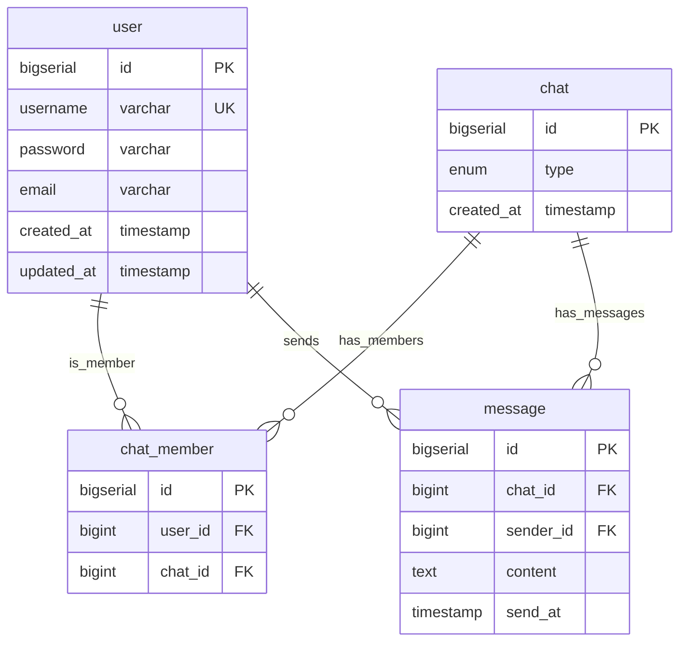
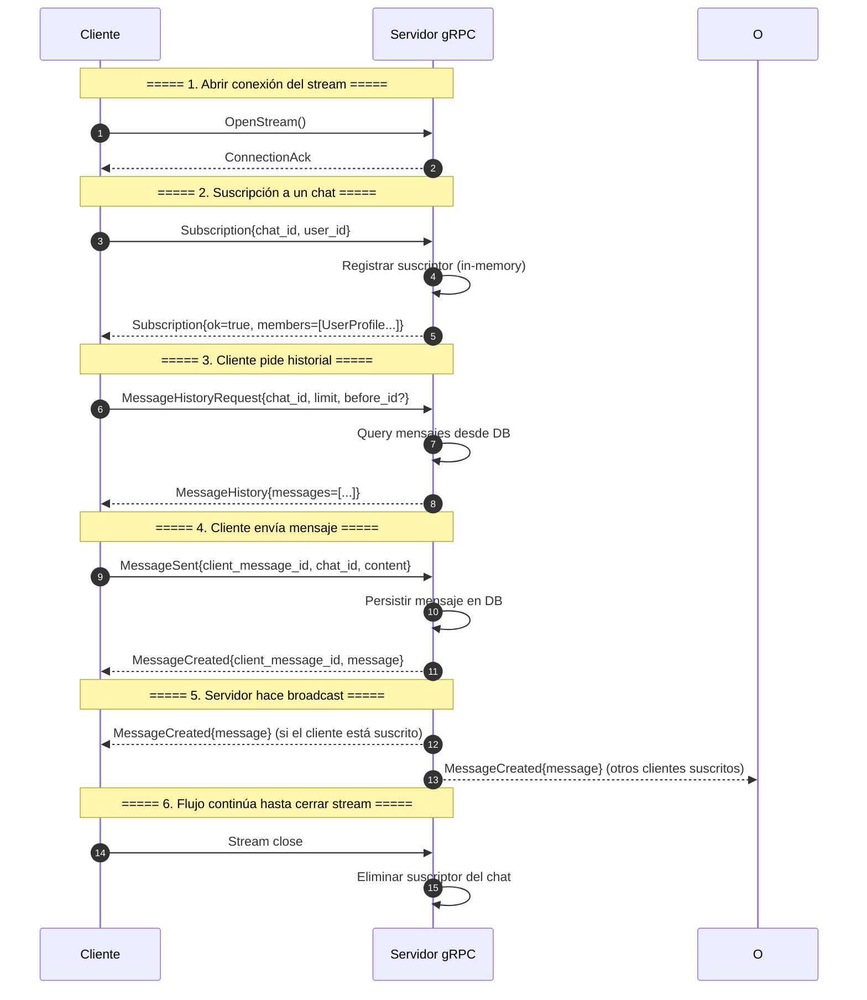

## Entity relationship

## Main sequence diagram high level

## **Componentes:**
1. **Version** (`v4`): Versión del protocolo
2. **Purpose**: 
   - `local`: Cifrado simétrico (compartir clave secreta)
   - `public`: Firma asimétrica (clave privada/pública)
3. **Payload**: Datos cifrados/firmados (base64url)
4. **Footer** (opcional): Metadata pública no protegida

### Paseto v4: Dos Modos

#### 1. **v4.local** (Cifrado Simétrico) 🔐

**Cuándo usarlo:**
- Tokens para tu propio sistema
- Service-to-service en misma org
- Cuando emisor = validador

**Criptografía:**
- **Algoritmo**: XChaCha20-Poly1305 (AEAD)
- **Clave**: 256 bits (32 bytes) simétrica
- **Garantías**: 
  - Confidencialidad (nadie puede leer el payload)
  - Autenticidad (no se puede modificar)
  - Protección contra replay (con implicit assertion)

### **Flujo:**

#### Emisor (tiene clave K):
1. Payload = {"user": "john", "exp": "..."}
2. Token = encrypt(Payload, K, nonce)
3. Envía: v4.local.EncryptedPayload

#### Validador (tiene misma clave K):
1. Recibe: v4.local.EncryptedPayload
2. Payload = decrypt(Token, K)
3. Valida claims (exp, nbf, etc.)

#### 2. **v4.public** (Firma Asimétrica)

**Cuándo usarlo:**
- Tokens para terceros
- APIs públicas
- Cuando emisor ≠ validador
- Múltiples servicios validando

**Criptografía:**
- **Algoritmo**: Ed25519 (firma digital)
- **Claves**: Par privada (firma) / pública (verifica)
- **Garantías**:
  - Autenticidad (firmado por quien tiene clave privada)
  - Integridad (no modificado)
  - NO confidencialidad (payload es visible)

### **Flujo:**

#### Emisor (tiene clave privada):
1. Payload = {"user": "john", "exp": "..."}
2. Token = sign(Payload, PrivateKey)
3. Envía: v4.public.SignedPayload

#### Validador (tiene clave pública):
1. Recibe: v4.public.SignedPayload
2. verify(Token, PublicKey) → Payload o error
3. Valida claims